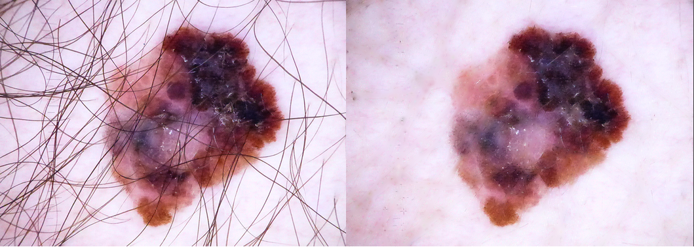
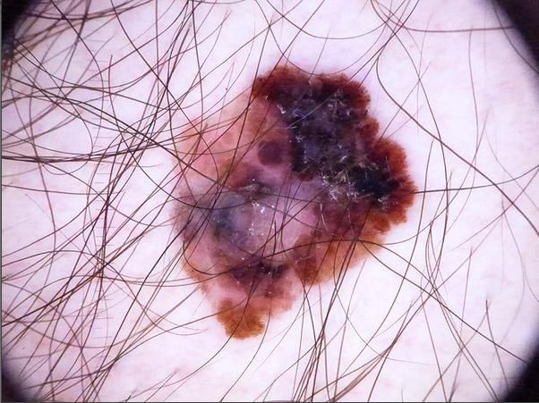
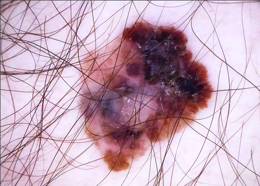
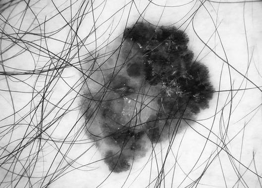
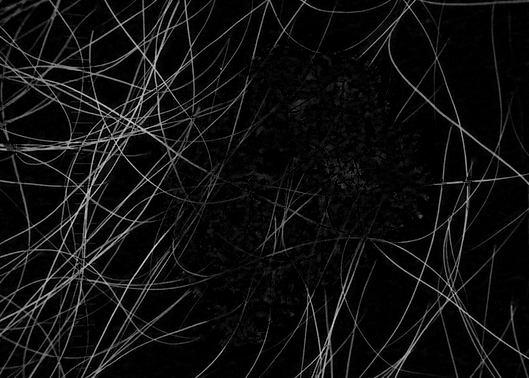
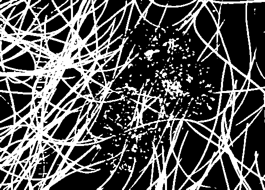
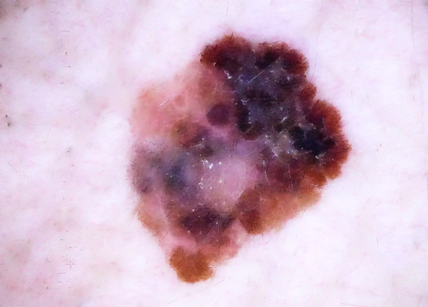

# Dullrazor algorithm 💻🧬

 

### Minimum requirements 

Programming language: <i>Python</i> 
Version language: <i>Python 3.8.8</i> 
Libraries: <i>OpenCV 4.5.1</i> 

Most images of skin lesions have unwanted elements, such as shadows and hairs, which can make it difficult to segment the lesion and introduce erroneous information on its characteristics. Therefore, it is necessary to apply some artificial vision techniques to eliminate any noise component.

Body hair is one of the factors that can affect lesion segmentation. For the detection and removal of hairs, a pre-processing technique called DullRazor is used, which consists of applying a series of morphological operations to the image in order to generate a mask that contains the hairs. The steps to apply the DullRazor algorithm are:

<ol>
    <li>Convert the original image to grayscale.</li>
    <li>Closing to the grayscale image, using a linear or cross-shaped kernel.</li>
    <li>Calculate the difference between the resulting image and the original.</li>
    <li>Apply binary thresholding to obtain a mask with the hairs in the image.</li>
    <li>Replace the pixels in common between the mask and the original image, with pixels from the latter.</li>
</ol>

For steps 2 and 3 of the DullRazor algorithm, the advanced morphological operation blackhat from the OpenCV library was used. On the other hand, the cv2.inpaint command from the same library was used in the last step of the algorithm.

## SCREENSHOTS

Input image from HAM10000 database.

### Input image
 

### Cropped image
 

### Gray scale image
 

### Black hat filter
 

### Binary Thresholding (Mask)
 

### Replace pixels of the mask (Output image)
 

<i>Developed by engineer Javier Velasquez (2020)</i>

